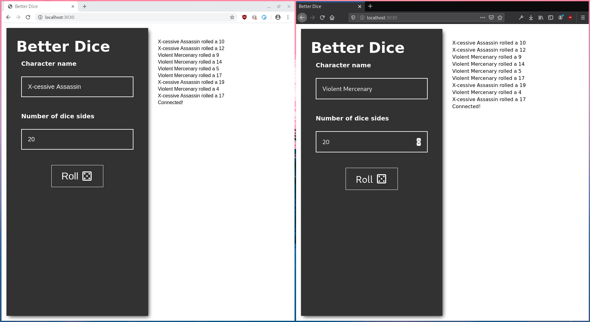

# Better Dice
A simple **synchronized** dice roll service for online pen and paper players.

## Getting Started
[Install rust](https://www.rust-lang.org/tools/install) and its tooling if you didn't already.
Clone the repository and run `cargo run --release`.
The default port is `3030` and can be changed to e.g. `4040` by passing the flag `--port 4040`.
By default the service binds to `127.0.0.1`.
To bind the service to `0.0.0.0`, pass the flag `--public`.
For a summary of commandline options, call the binary with the `--help` flag.

```
cargo run --release -- --help
```



## Why?
Recently i played my first round of online pen and paper.
Most of the time the person rolling the dice shared the screen while rolling the dice to "proof" the result.
Hence i wanted to provide a better solution for my group. 

## How?

For a minimal Javascript footprint, [Server Sent Events (SSE)](https://developer.mozilla.org/en-US/docs/Web/API/Server-sent_events/Using_server-sent_events) are used to synchronize dice roll results.

Backend is written in Rust with [warp](https://docs.rs/warp/0.2.2/warp/).
